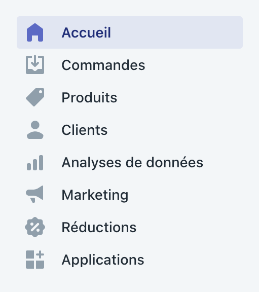
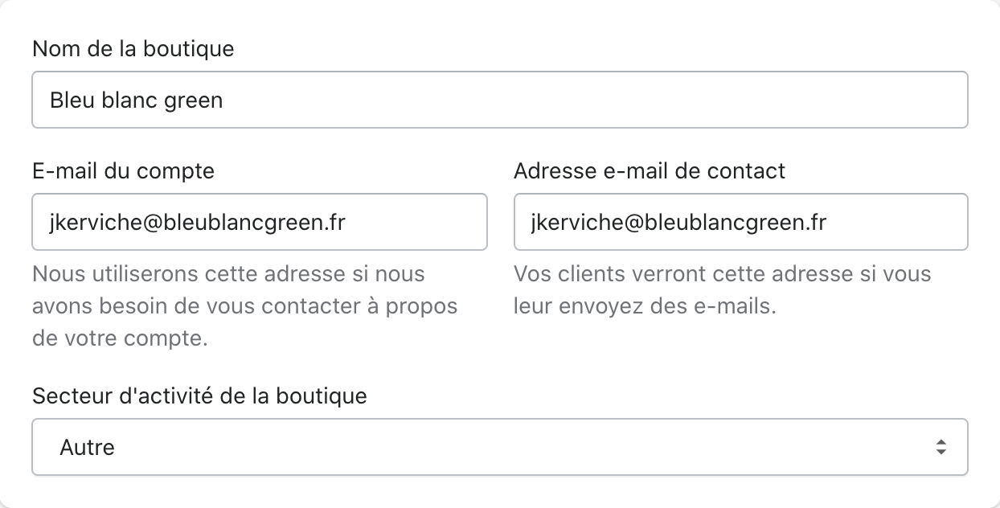

# Mode d'emploi Shopify

## Adresse de connexion

L'adresse de connexion au backoffice de **Shopify** est ici: [https://bleu-blanc-green.myshopify.com/admin](https://bleu-blanc-green.myshopify.com/admin)

## Présentation du backoffice

### Commandes

Retrouvez dans l'onglet **Commandes** toutes les commandes effectuées sur le shop.

### Produits

En cliquant sur le bouton **Ajouter un produit** vous pouvez ajouter un produit.

Vous pouvez ajouter sur le produit un **titre**, une **description**, ou encore ajouter les images du produit.

### Clients

Les comptes des clients incrits sur le site ce retrouve ici.

### Analyses des données

### Marketing

### Réductions

### Paramètres

## Menu général

Vous pouvez ici modifier les informations générales de la boutique, et notamment le **nom de la boutique**.

### Informations sur la boutique

